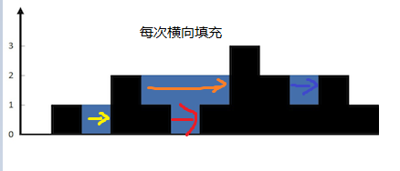

# 42. 接雨水

**<pre>
给定 n 个非负整数表示每个宽度为 1 的柱子的高度图，计算按此排列的柱子，下雨之后能接多少雨水。
</pre>**

<pre>
示例 1：
输入：height = [0,1,0,2,1,0,1,3,2,1,2,1]
输出：6
解释：上面是由数组 [0,1,0,2,1,0,1,3,2,1,2,1] 表示的高度图，在这种情况下，可以接 6 个单位的雨水（蓝色部分表示雨水）。 
</pre>


<pre>
示例 2：
输入：height = [4,2,0,3,2,5]
输出：9
</pre>
<pre>
提示：
n == height.length
1 <= n <= 2 * 104
0 <= height[i] <= 105
</pre>
```c++
class Solution {
public:
    int trap(vector<int>& height) {
        int ans = 0;
        int len = height.size();
        stack<int> sta;
        // 从左往右遍历，维护单调递减栈，从栈中弹出小于等于当前值的数据，每次弹出进行横向填充计算(依赖弹出后的栈顶计算矩形面积)
        for (int i = 0; i < len; i++) {
            while(!sta.empty() && height[i] >= height[sta.top()]) {
                int old_height = height[sta.top()];
                // 弹出旧值
                sta.pop();
                if (sta.empty()) break;
                // 计算横向填充的矩形面积
                ans += (min(height[i], height[sta.top()]) - old_height) * (i - sta.top() - 1);
            }
            sta.push(i);
        }
        return ans;
    }
};
```
